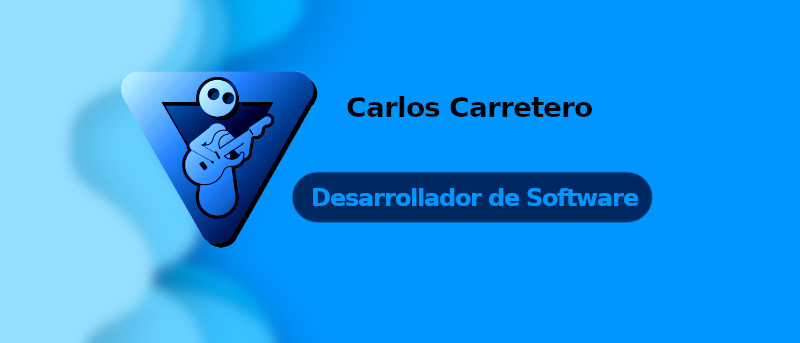

  <h1>¡Hola! Soy Carlos Carretero 👋 </h1>

    <h2> Para una información más estética y detallada   vistita mi portafolio <a href="https://carloscanav.github.io/">CarlosCaNav.github.io</a>   </h2>

<!--
**CarlosCaNav/CarlosCaNav** is a ✨ _special_ ✨ repository because its `README.md` (this file) appears on your GitHub profile.

Here are some ideas to get you started:

- 🔭 I’m currently working on ...
- 🌱 I’m currently learning ...
- 👯 I’m looking to collaborate on ...
- 🤔 I’m looking for help with ...
- 💬 Ask me about ...
- 📫 How to reach me: ...
- 😄 Pronouns: ...
- ⚡ Fun fact: ...
-->
